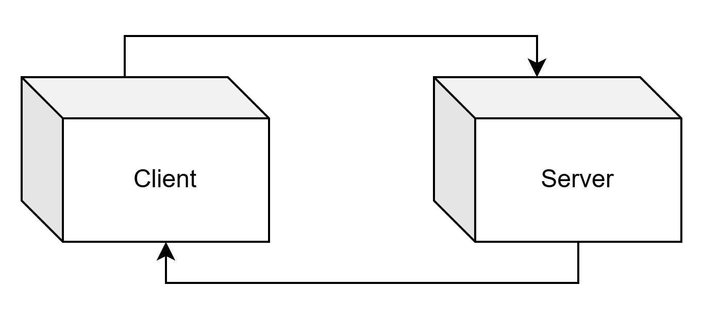
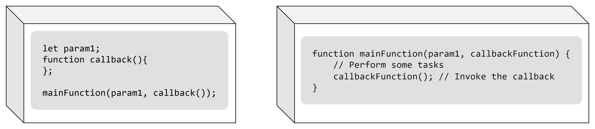

# <a id="title"> Refatoração de Callbacks para Funções Distribuídas</a>

Em JavaScript, callbacks são funções passadas como argumentos para outras funções

```javascript
function mainFunction(param1, callbackFunction) {
    // Perform some tasks
    callbackFunction(); // Invoke the callbak
}
```

Para utilizar essa função, você passaria o argumento e uma função de callback.

```javascript
let param1;
function callback(){
};
mainFunction(param1, callback());
```

## Problema

Ao tentar transformar uma função em um serviço ou microsserviço, pode-se enfrentar um problema quando um ou mais de seus argumentos são callbacks. Esses argumentos não podem ser enviados de forma trivial pela rede, pois seria necessário transmitir todo o contexto da função resultando em grande complexidade e, em muitos casos, pode ser impossível garantir a consistência entre o contexto original e o transmitido.

## Solução

Usar o sistema de filas de mensagem para desacoplar os processos garantindo uma comunicação entre os serviços a fim de evitar os problemas citados (ex: RabbitMQ)

```javascript
channel.sendToQueue(
    callbackQueue,
    Buffer.from(msgContent)
);
```


## Porque Refatorar

O uso de callbacks, embora eficiente em sistemas pequenos, pode gerar um acoplamento excessivo entre componentes e tornar o código mais difícil de gerenciar à medida que o sistema cresce

## Benefícios da Refatoração

A comunicação via filas desacopla os produtores e consumidores de mensagens, permitindo maior flexibilidade e manutenção. Além disso, é possível também acoplar diversos callbacks utilizando um sistema de broadcast.

## Como Refatorar

Para começar a refatoração é necessário criar dois nós. Um `Client` e um `Server`.



Um `Client` ficará responsável por iniciar a chamada e incluir a lógia da função de callback e um `Server` por conter a lógica e a definição da função principal.



Obs: É possível usar um modelo pré-definido para uma [refatoração rápida](#quick-refactor)

### Server Node

1. No nó server primeiro adicionamos a função principal exatamente como ela foi definida

```javascript
// server_node.js

function mainFunction(param1, callbackFunction) {
    // Perform some tasks
    callbackFunction(); // Invoke the callbak
}
```

2. Agora é necessário definir a comunicação do server através da função `mainFunction_server()`. Para isso é necessário importar o protocolo `amqp` e criar a `connection` e `channel`.

```javascript
// server_node.js

import amqp from 'amqplib';

export async function mainFunction_server() {

    const connection = await amqp.connect('amqp://localhost');
    const channel = await connection.createChannel();
}

mainFunction_server();
```

3. Dentro da função `mainFunction_server()`, definimos a fila do Server e consumimos a mensagem passada pelo cliente e seus respectivos parâmetros.

```javascript
// server_node.js

...

    const mainFunctionQueue = 'mainFunction_call_queue';
    await channel.assertQueue(mainFunctionQueue, { durable: false });

    channel.consume(mainFunctionQueue, async (msg) => {
        const params = JSON.parse(msg.content.toString());
        const callbackQueueName = params.callbackQueueName
        const param1 = params.param1
        
    }, { noAck: true });

...

```

4. Por fim dentro do método `channel.consume`, utilizamos os parâmetros recebidos pelo server e passamos para a chamada da função `mainFunction()` definida previamente para que seja executada a lógica da função principal. Posteriormente eviamos a resposta para o nó do cliente que está esperando na fila contida em `callbackQueueName`. 

```javascript
// server_node.js

...

        mainFunction(param1, (result) => {
            const msgContent = {
                result: result
            }

            channel.sendToQueue(
                callbackQueueName,
                Buffer.from(JSON.stringify(msgContent))
            );
        })
...

```

5. O código completo do nó do server é descrito a seguir:

```javascript
// server_node.js

import amqp from 'amqplib';

export async function mainFunction_server() {

    const connection = await amqp.connect('amqp://localhost');
    const channel = await connection.createChannel();

    const mainFunctionQueue = 'mainFunction_call_queue';
    await channel.assertQueue(mainFunctionQueue, { durable: false });

    channel.consume(mainFunctionQueue, async (msg) => {
        const params = JSON.parse(msg.content.toString());
        const callbackQueueName = params.callbackQueueName
        const param1 = params.param1

        mainFunction(param1, (result) => {
            const msgContent = {
                result: result
            }

            channel.sendToQueue(
                callbackQueueName,
                Buffer.from(JSON.stringify(msgContent))
            );
        })   

    }, { noAck: true });

}

function mainFunction(param1, callbackFunction) {
    // Perform some tasks
    callbackFunction(); // Invoke the callbak
}

mainFunction_server();

```

### Client Node

1. No nó client começamos por definir uma função main() e dentro dela a chamada da função principal (nesse exemplo chamaremos de `mainFunction_client`) com seus respectivos argumentos: param1 e a função de callback.

```javascript
// client_node.js

function main() {
    let param1;
    function callback(){
    };

    mainFunction(param1, callback());
}

main();
```

2. Nessa etapa, ainda no nó cliente vamos definir a função mainFunction_client() e sua comunicação com o nó servidor. Para isso utilizaremos o **`RabbitMQ`**, importando o protocolo `amqp` e criando uma `connection` e um `channel`

```javascript
// client_node.js

import amqp from 'amqplib';

export async function mainFunction_client(param1, callback) {

    const connection = await amqp.connect('amqp://localhost');
    const channel = await connection.createChannel();

}

...
```

3. Para realizar a troca de mensagens é necessário ciar uma fila de retorno `mainFunction_callback_queue` e passar essa informação junto com o parâmetro `param1` para o Server que vai estar esperando a informação na fila `mainFunction_call_queue`. Com esses dados, enviamos tudo através do método **`sendToQueue`**.

```javascript
// client_node.js

...

    const callbackQueue = 'mainFunction_callback_queue';
    await channel.assertQueue(callbackQueue, { durable: false });

    const msgContent = {
        param1: param1,
        callbackQueueName: callbackQueue
    }

    channel.sendToQueue(
        'mainFunction_call_queue',
        Buffer.from(JSON.stringify(msgContent))
    );

...
```

4. Por fim precisamos consumir a resposta do server que vai ser enviada na fila de callback `mainFunction_callback_queue` e executar a lógica do callback.

```javascript
// client_node.js

...

    channel.consume(callbackQueue, async (msg) => {
        const params = JSON.parse(msg.content.toString());
        const result = params.result

        callback(result)

    }, { noAck: true });

...

```

5. O código completo do client está representado a seguir:

```javascript
// client_node.js

import amqp from 'amqplib';

export async function mainFunction_client(param1, callback) {

    const connection = await amqp.connect('amqp://localhost');
    const channel = await connection.createChannel();

    const callbackQueue = 'mainFunction_callback_queue';
    await channel.assertQueue(callbackQueue, { durable: false });

    const msgContent = {
        param1: param1,
        callbackQueueName: callbackQueue
    }

    channel.consume(callbackQueue, async (msg) => {
        const params = JSON.parse(msg.content.toString());
        const result = params.result

        callback(result)

    }, { noAck: true });

    channel.sendToQueue(
        'mainFunction_call_queue',
        Buffer.from(JSON.stringify(msgContent))
    );

}


function main() {
    let param1;
    function callback(){
    };
    
    mainFunction(param1, callback());
}

main();

```

## Refatoração com exemplos

A seguir aplicamos o passo a passo da refatorção para as funções descritas e exemplificamos o resultado dos nó client e server

### Basic Log Example

```javascript
function mainFunction(callbackFunction) {
    console.log('Performing operation...');

    callbackFunction('Operation complete');
}

mainFunction(function (result) {
    console.log('Result: ' + result)
});
```

### Sever Node
```javascript
import amqp from 'amqplib';

function mainFunction(callbackFunction) {
    console.log('Performing operation...');

    callbackFunction('Operation complete');
}

export async function mainFunction_server() {

    const connection = await amqp.connect('amqp://localhost');
    const channel = await connection.createChannel();

    const mainFunctionQueue = 'mainFunction_call_queue';
    await channel.assertQueue(mainFunctionQueue, { durable: false });

    channel.consume(mainFunctionQueue, async (msg) => {
        const params = JSON.parse(msg.content.toString());
        const callbackQueueName = params.callbackQueueName

        mainFunction((result) => {
            const msgContent = {
                result: result
            }

            channel.sendToQueue(
                callbackQueueName,
                Buffer.from(JSON.stringify(msgContent))
            );
        })     

    }, { noAck: true });

}

mainFunction_server();
```

### Client Node

```javascript
import amqp from 'amqplib';

export async function mainFunction_client(callback) {

    const connection = await amqp.connect('amqp://localhost');
    const channel = await connection.createChannel();

    const callbackQueue = 'mainFunction_callback_queue';
    await channel.assertQueue(callbackQueue, { durable: false });

    const msgContent = {
        callbackQueueName: callbackQueue
    }

    channel.consume(callbackQueue, async (msg) => {
        const params = JSON.parse(msg.content.toString());
        const result = params.result

        callback(result)

    }, { noAck: true });

    channel.sendToQueue(
        'mainFunction_call_queue',
        Buffer.from(JSON.stringify(msgContent))
    );

}


function main(){
    mainFunction_client(function (result) {
        console.log('Result: ' + result)
    });
}

main();
```

### Array of numbers as parameter Example

```javascript
function mainFunction(arrayOfNumbers, callbackFunction) {
    console.log('Performing operation...');

    arrayOfNumbers.forEach(callbackFunction)
}

let inputArray = [1, 2, 3, 4, 5];

mainFunction(inputArray, function (number) {
    console.log('Result: ' + number)
});
```

### Server Node

```javascript
import amqp from 'amqplib';

function mainFunction(arrayOfNumbers, callbackFunction) {
    console.log('Performing operation...');

    arrayOfNumbers.forEach(callbackFunction)
}

export async function mainFunction_server() {

    const connection = await amqp.connect('amqp://localhost');
    const channel = await connection.createChannel();

    const mainFunctionQueue = 'mainFunction_call_queue';
    await channel.assertQueue(mainFunctionQueue, { durable: false });

    channel.consume(mainFunctionQueue, async (msg) => {
        const params = JSON.parse(msg.content.toString());
        const callbackQueueName = params.callbackQueueName
        const inputArray = params.inputArray

        mainFunction(inputArray, (result) => {
            const msgContent = {
                result: result
            }

            channel.sendToQueue(
                callbackQueueName,
                Buffer.from(JSON.stringify(msgContent))
            );
        })
        

    }, { noAck: true });

}

mainFunction_server();
```

### Client Node

```javascript
import amqp from 'amqplib';

export async function mainFunction_client(inputArray, callback) {

    const connection = await amqp.connect('amqp://localhost');
    const channel = await connection.createChannel();

    const callbackQueue = 'mainFunction_callback_queue';
    await channel.assertQueue(callbackQueue, { durable: false });

    const msgContent = {
        inputArray: inputArray,
        callbackQueueName: callbackQueue
    }

    channel.consume(callbackQueue, async (msg) => {
        const params = JSON.parse(msg.content.toString());
        const result = params.result

        callback(result)

    }, { noAck: true });

    channel.sendToQueue(
        'mainFunction_call_queue',
        Buffer.from(JSON.stringify(msgContent))
    );

}


function main() {
    let inputArray = [1, 2, 3, 4, 5];

    mainFunction_client(inputArray, function (number) {
        console.log('Result: ' + number)
    });
}

main();
```

## <a id="quick-refactor"> Refatoração Rápida</a>

Para callbacks mais simples é possível utilizar o modelo abaixo e apenas substituir com a lógica da função a ser refatorada.

### Server Node
```javascript
import amqp from 'amqplib';

export async function mainFunction_server() {

    const connection = await amqp.connect('amqp://localhost');
    const channel = await connection.createChannel();

    /*
    --> Escolher um nome para a fila de call<--
    */
    const mainFunctionQueue = 'mainFunction_call_queue';
    await channel.assertQueue(mainFunctionQueue, { durable: false });

    channel.consume(mainFunctionQueue, async (msg) => {
        const params = JSON.parse(msg.content.toString());
        const callbackQueueName = params.callbackQueueName
        /*
        --> Listar os parametros <--
        */
        const param1 = params.param1
        const param2 = params.param2
        const param3 = params.param3

        mainFunction(param1, param2, param3, (result) => {
            const msgContent = {
                result: result
            }

            channel.sendToQueue(
                callbackQueueName,
                Buffer.from(JSON.stringify(msgContent))
            );
        })
    }, { noAck: true });
}

/*
--> Inserir a definição da função <--
*/
function mainFunction(param1, param2, param3, callbackFunction) {
    callbackFunction();
}

mainFunction_server();
```

### Client Node
```javascript
import amqp from 'amqplib';

export async function mainFunction_client(param1, param2, param3, callback) {

    const connection = await amqp.connect('amqp://localhost');
    const channel = await connection.createChannel();

    /*
    --> Escolher um nome para a fila de callback<--
    */
    const callbackQueue = 'mainFunction_callback_queue';
    await channel.assertQueue(callbackQueue, { durable: false });

    const msgContent = {
        /*
        --> Listar os parametros <--
        */
        param1: param1,
        param2: param2,
        param3: param3,
        callbackQueueName: callbackQueue
    }

    channel.consume(callbackQueue, async (msg) => {
        const params = JSON.parse(msg.content.toString());
        const result = params.result

        callback(result)

    }, { noAck: true });

    /*
    --> Enviar para a fila definida no server node<--
    */
    channel.sendToQueue(
        'mainFunction_call_queue',
        Buffer.from(JSON.stringify(msgContent))
    );

}

/*
--> Inserir a chamada da função com a função de callback <--
*/
function main() {
    let param1, param2, param3;
    function callback(){
    };

    mainFunction_client(param1, param2, param3, callback());
}

main();
```

## Limitações

- Alguns parâmetros das funções podem não ser transformados corretamente. Esses parâmetros precisam ser valores que possam ser serializados pelo método [**`JSON.stringify()`**](https://developer.mozilla.org/en-US/docs/Web/JavaScript/Reference/Global_Objects/JSON/stringify#description). Ou seja, objetos simples (como objetos literais, arrays e tipos primitivos) são compatíveis, mas funções, instâncias de classes e objetos com métodos ou propriedades não serializáveis podem não ser corretamente processados

- É possível utilizar a mesma fila para diferentes funções, porém verificações adicionais são necessárias para garatir a integridade dos dados, pode se utilizar por exemplo uma variável de controle `funcName: "nome_funcao"` dentro do objeto  que contém os parâmetros

---
